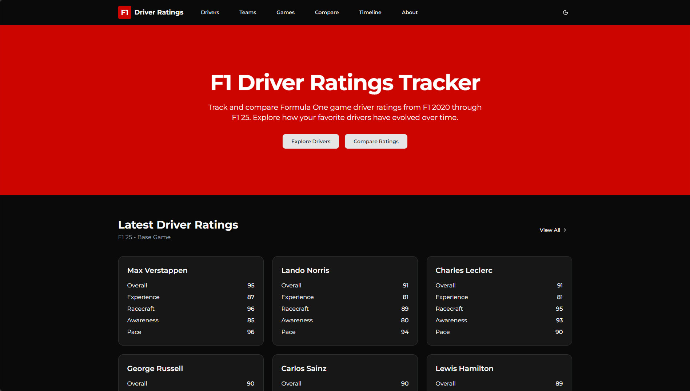

# 🏎️ F1 Game Ratings

A deep dive into the official Formula One Game by EA & Codemasters' Driver Ratings — visualised, analysed, and tracked over time.

 <!-- Replace with actual screenshot path -->

## 🌐 Live Website

👉 [Visit the site](https://f1ratings.phaseo.app)

## 📊 What is this?

This open-source project tracks and visualises **Formula One driver ratings** from EA & Codemasters' official F1 Game.

### It includes:

-   🧠 Driver stats across all key categories (Overall, Experience, Racecraft, Awareness, and Pace)
-   📈 Rating progression across official game releases
-   🏆 Compare drivers head-to-head across different seasons
-   🔁 Continuous updates as new ratings are released

Perfect for:

-   F1 fans
-   Esports and sim racers
-   Data nerds

## 🚀 Getting Started

Clone the repo and run it locally:

```bash
git clone https://github.com/danielbutler1/f1-game-ratings
cd f1-game-ratings
npm install
npm run dev
```

## 🛠️ Tech Stack

-   🧱 Next.js for the frontend
-   🎨 Tailwind CSS for styling
-   📦 Local JSON files for driver data
-   📊 Recharts for visualisations
-   🪶 Lucide for icons

## 🧩 Contributing

We welcome contributions of all types — code, bug fixes, new data, ideas, even UI tweaks!
To contribute:

1. Fork the repo
2. Create a new branch
3. Submit a pull request with a clear description
4. Follow our Contribution Guidelines

Issues labeled **good first issue** are perfect for newcomers!

## 📁 Data Format

All driver ratings are stored in src/data/rankings.json.
The structure is grouped by game version, where each game key maps to a list of drivers and their ratings:

```json
{
	"F1 2020 (B)": [
		{
			"name": "Alexander Albon",
			"overall": 79,
			"experience": 52,
			"racecraft": 87,
			"awareness": 78,
			"pace": 83
		},
		{
			"name": "Antonio Giovinazzi",
			"overall": 73,
			"experience": 47,
			"racecraft": 73,
			"awareness": 70,
			"pace": 79
		}
		// ... more drivers
	],
	"F1 2021 (B)": [
		{
			"name": "Lewis Hamilton",
			"overall": 95,
			"experience": 98,
			"racecraft": 97,
			"awareness": 94,
			"pace": 96
		}
		// ... more drivers
	]
	// ... more game versions
}
```

Game versions follow the naming convention "[F1 game] [update number]".

## 📜 License

-   **Code** is original work by Phaseo and is **not licensed for commercial reuse or redistribution**.
-   **Game data** remains the property of EA Sports and Codemasters and is used **for non-commercial, fan-educational purposes only**.
-   **Visual and written content** is licensed under [CC BY-NC-ND 4.0](https://creativecommons.org/licenses/by-nc-nd/4.0/).

See [`LICENSE.md`](./LICENSE.md) for full details.

## 💬 Community & Feedback

Found a bug or have a suggestion?

-   Open an issue
-   Join the conversation on [Discord](https://discord.gg/zDw73wamdX)

---

This is a fan made, unofficial project and is not affiliated with EA, Codemasters, or Formula 1. All game data is used for educational and fan purposes only.

Made with ❤️ by F1 fans for F1 fans.
